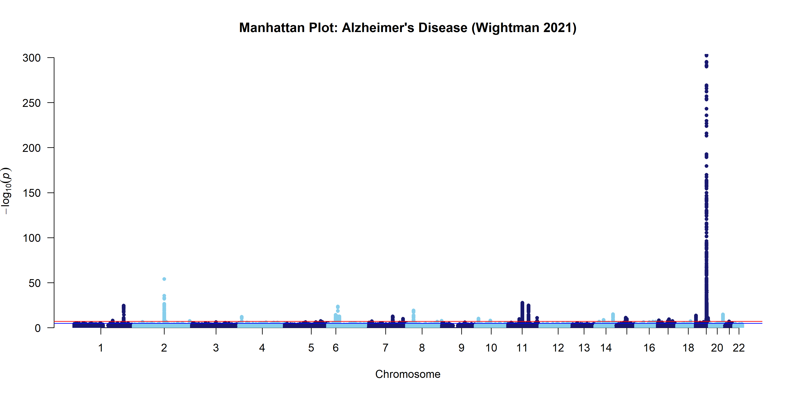
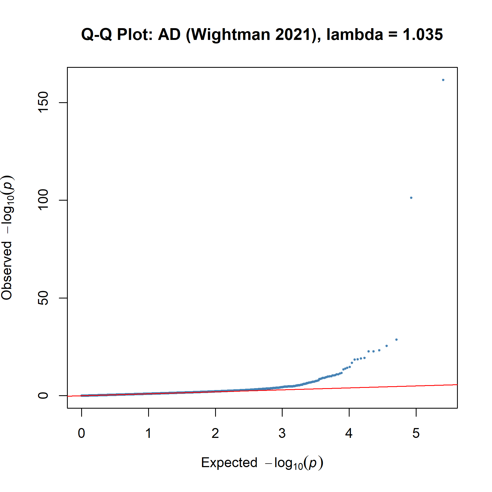

# AD-GWAS-Analysis: Alzheimer's Disease Genetic Risk Loci Identification

A memory-efficient R pipeline for analyzing massive-scale GWAS summary statistics, specifically applied to the **Wightman et al. (2021)** Alzheimer's Disease dataset.

## Key Findings
### Manhattan Plot

*Figure 1: High-impact association signals identified in the APOE region (Chr 19).*
### Q-Q Plot

*Figure 2: Genomic inflation factor is equal to 1.035.*

## Key Achievements
- **Scale**: Processed and harmonized **12.68 million variants** from a cohort of **1.1 million individuals**.
- **Robustness**: Achieved a genomic inflation factor ($\lambda_{GC}$) of **1.035**, indicating minimal overall inflation.
- **Insights**: Successfully identified and visualized the high-impact **APOE** signal on Chromosome 19.

## Methodology
- **Memory Management**: Utilised dynamic reclamation (`rm()` and `gc()`) to process 12M+ rows on personal hardware.
- **Statistical Viz**: Manhattan and Q-Q plots generated via `qqman` with strategic downsampling for performance.

## Data Source
Analysis based on Wightman et al. (2021), *Nature Genetics* (PMID: 34493870).
